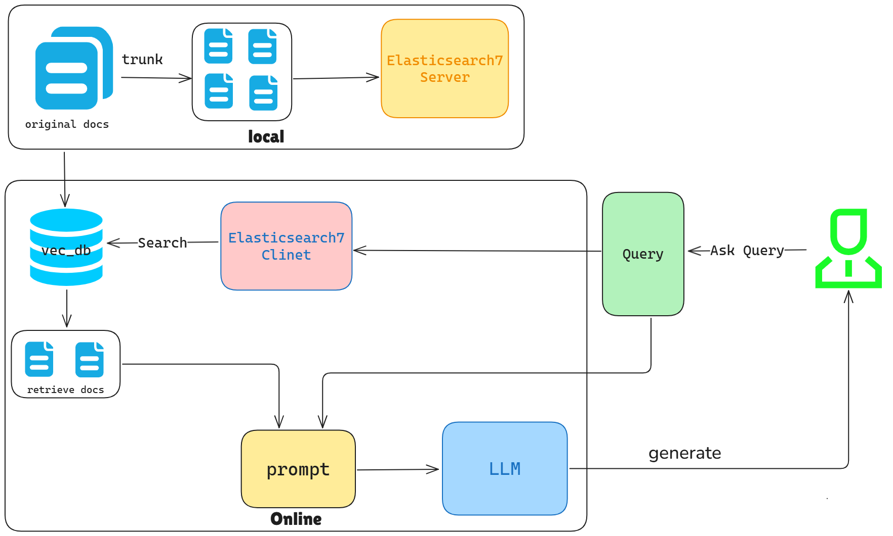

# *Rag-Chat*

## **Description**

This is a continuously updated Rag-Chat that introduces some of the principles and source code of Rag in the LLM



## **Get Start**

### **Env require**

> *Windows*

> Elasticsearch7([Server](https://mirrors.huaweicloud.com/elasticsearch/7.13.2/))

> text2vec([text2vec-base-multilingual](https://modelscope.cn/models/SJ007NB/text2vec-base-multilingual))

> Embedding([bge-large-zh-v1.5](https://modelscope.cn/models/AI-ModelScope/bge-large-zh-v1.5/summary))

> LLM_api_key
>    1. [ChatGLM](https://bigmodel.cn/)
>    2. [Spark](https://xinghuo.xfyun.cn/?ch=bdtg_xh_kw662&bd_vid=11798071775495923073)
>    3. [Qwen](https://www.aliyun.com/product/tongyi?utm_content=se_1019167001&_v_=47edc66742fe36fc0a839ea5700b8cd5)


> anconda

> Python >= 3.8

> GPU >= 4G

### **Start based on conda(Python >= 3.8):**

*Download [Elasticsearch7](https://mirrors.huaweicloud.com/elasticsearch/7.13.2/)*
> ```bash
> ./bin/elasticsearch.bat
> ```
> Test Elasticsearch7 Server Connection on http://localhost:9200 

*Git clone required envs*
> text2vec
> ```bash
> git clone https://www.modelscope.cn/SJ007NB/text2vec-base-multilingual.git
> ```

> embedding model
> ```bash
> git clone https://www.modelscope.cn/AI-ModelScope/bge-large-zh-v1.5.git
> ```


*Use conda to create an envs*
```bash
conda create -n rag-chat python=3.10
```
*activate conda envs*
```bash
conda activate rag-chat
```
*install required envs(GPU)*
```bash
conda install -c pytorch -c nvidia faiss-gpu=1.9.0
```

```bash
pip install -r ./requirements.txt
```

*Then run **`rag-chat.ipynb`** by yourself*

*Go to find some helpful code when learning RAG*

### **Join us**

if you are interested in Rag-Chat, ou can contact me by scanning the following QR code OR raising an issue


And thank you for browsing, liking, and bookmarking. This will definitely be a great motivation for my future updates.